```mermaid
erDiagram
    USUARIOS {
        int id PK
        varchar tipo_identificacion "CC|TI|NIT|RCN"
        varchar identificacion
        varchar nombres
        varchar apellidos
        varchar correo
        varchar clave
        varchar celular
        timestamp ultimo_acceso
        varchar estado "ACTIVO|INACTIVO|SUSPENDIDO|PENDIENTE"
        int rol_id FK
        int entidad_salud_id FK
        varchar actualizado_por "AUDITABLE - Incluido en DTO"
        varchar creado_por "AUDITABLE - Convertido a ID en DTO"
        timestamp fecha_actualizacion "AUDITABLE - Incluido en DTO"
        timestamp fecha_creacion "AUDITABLE - Incluido en DTO"
        varchar actualizado_por "AUDITABLE - Incluido en DTO"
        varchar creado_por "AUDITABLE - Convertido a ID en DTO"
        timestamp fecha_actualizacion "AUDITABLE - Incluido en DTO"
        timestamp fecha_creacion "AUDITABLE - Incluido en DTO"
    }

    ROLES {
        int id PK
        varchar nombre "administrador|desarrollador|entidad_salud|medico|auxiliar|paciente|embajador"
        text descripcion
        jsonb permisos
    }

    ENTIDADES_SALUD {
        int id PK
        varchar razon_social
    }

    EMBAJADORES {
        int id PK
        int usuario_id FK
        bigint localizacion_id FK
    }

    EMBAJADORES_ENTIDADES {
        int id PK
        int embajador_id FK
        int entidad_id FK
    }

    PERSONAL_MEDICO {
        int id PK
        varchar especialidad
        int entidad_id FK
        int usuario_id FK
    }

    PACIENTES {
        int id PK
        date fecha_nacimiento
        enum genero "MASCULINO|FEMENINO"
        varchar direccion
        enum tipo_sangre "A_POSITIVO|A_NEGATIVO|B_POSITIVO|B_NEGATIVO|AB_POSITIVO|AB_NEGATIVO|O_POSITIVO|O_NEGATIVO"
        bigint localizacion_id FK
        int usuario_id FK
    }

    LOCALIZACION {
        bigint id PK
        varchar departamento
        varchar municipio
        varchar vereda
        varchar localidad
        decimal latitud
        decimal longitud
    }

    CAMPANAS {
        int id PK
        varchar nombre
        text descripcion
        bigint localizacion_id FK
        date fecha_inicio
        date fecha_limite_inscripcion
        int min_participantes
        int max_participantes
        int entidad_id FK
        varchar estado "POSTULADA|EJECUCION|FINALIZADA|CANCELADA"
    }

    INSCRIPCIONES_CAMPANA {
        int id PK
        int usuario_id FK
        int campana_id FK
        timestamp fecha_inscripcion
        varchar estado "INSCRITO|RETIRADO"
        text motivo_retiro
        varchar actualizado_por
        varchar creado_por
        timestamp fecha_actualizacion
        timestamp fecha_creacion
    }

    SERVICIOS_MEDICOS {
        int id PK
        varchar nombre
        text descripcion
    }

    SERVICIOS_CAMPANA {
        int id PK
        int campana_id FK
        int servicio_id FK
    }

    FACTORES_RIESGO {
        int id PK
        varchar nombre
        text descripcion
        varchar tipo "SOCIAL|AMBIENTAL|RACIAL"
    }

    CAMPANA_FACTORES {
        int id PK
        int campana_id FK
        int factor_id FK
    }

    TRIAJES {
        int id PK
        int paciente_id FK
        int edad
        boolean actividad_fisica
        boolean tabaquismo
        boolean alcoholismo
        boolean diabetes
        boolean dolor_pecho
        boolean dolor_irradiado
        boolean sudoracion
        boolean nauseas_frecuentes
        boolean antecedentes_cardiacos
        boolean hipertension
        varchar descripcion
        float peso
        float estatura
        date fecha_triaje
        varchar actualizado_por
        varchar creado_por
        timestamp fecha_actualizacion
        timestamp fecha_creacion
    }

    DATOS_CLINICOS {
        int id PK
        int paciente_id FK
        decimal presion_sistolica
        decimal presion_diastolica
        decimal frecuencia_cardiaca_min
        decimal frecuencia_cardiaca_max
        decimal saturacion_oxigeno
        decimal temperatura
        decimal colesterol_total
        decimal hdl
        text observaciones
        date fecha_medicion
        varchar actualizado_por
        varchar creado_por
        timestamp fecha_actualizacion
        timestamp fecha_creacion
    }

    FACTORES_PACIENTE {
        int id PK
        int paciente_id FK
        int factor_id FK
        varchar observacion
    }

    CITACIONES {
        int id PK
        int paciente_id FK
        int campana_id FK
        int medico_id FK
        timestamp hora_programada
        timestamp hora_atencion
        int duracion_estimada "minutos"
        varchar estado "AGENDADA|ATENDIDA|CANCELADA"
        decimal prediccion_asistencia "0-100%"
        varchar codigoTicket "Ej: OCV21"
        text notas
    }

    HISTORIAS_CLINICAS {
        int id PK
        int paciente_id FK
        int ultimo_triaje_id FK
        int ultimos_datos_clinicos_id FK
        int ultimo_diagnostico_id FK
        int ultima_recomendacion_id FK
        int ultimo_seguimiento_id FK
        int ultima_prescripcion_id FK
        decimal prob_rehospitalizacion "0-100%"
    }

    DIAGNOSTICOS {
        int id PK
        int citacion_id FK
        timestamp fecha_hora_inicio
        timestamp fecha_hora_fin
        int duracion_real "minutos"
        varchar estado "EN_PROCESO|COMPLETADA"
    }

    DIAGNOSTICOS {
        int id PK
        int atencion_id FK
        varchar codigo_cie10
        text descripcion
        boolean es_principal
        varchar severidad "LEVE|MODERADA|GRAVE"
    }

    PRESCRIPCIONES {
        int id PK
        int diagnostico_id FK
        varchar tipo "MEDICAMENTO|ESTILO_VIDA|ACTIVIDAD_FISICA|DIETA"
        text descripcion
        varchar dosis
        varchar frecuencia
        varchar duracion
        text indicaciones_especiales
    }

    SEGUIMIENTOS {
        int id PK
        int citacion_id FK
        date fecha_programada
        date fecha_realizada
        varchar tipo "LLAMADA|SMS|PRESENCIAL"
        text resultado
        text notas
        varchar estado "PENDIENTE|REALIZADO|CANCELADO"
        varchar prioridad "ALTA|MEDIA|BAJA"
    }

    PREDICCIONES {
        int id PK
        int paciente_id FK
        int campana_id FK
        varchar tipo "RIESGO_CV|ASISTENCIA|HOSPITALIZACION|REHOSPITALIZACION"
        decimal valor_prediccion "0-100%"
        decimal confianza "0-100%"
        jsonb factores_influyentes "{ edad: float, presion_sistolica: float, ... }"
        varchar nivel_riesgo "BAJO|MODERADO|ALTO|CRITICO"
        jsonb recomendaciones "[string]"
        timestamp fecha_prediccion
        varchar modelo_version
        varchar actualizado_por
        varchar creado_por
        timestamp fecha_actualizacion
        timestamp fecha_creacion
    }

    INTERACCIONES_CHATBOT {
        int id PK
        int paciente_id FK
        int seguimiento_id FK
        text entrada_texto
        text respuesta_texto
        varchar intent_detectado
        jsonb contexto_conversacion
    }

    RECOMENDACIONES {
        int id PK
        int diagnostico_id FK
        text descripcion
        varchar nivel_importancia "ALTA|MEDIA|BAJA"
        varchar tipo "MEDICAMENTO|ESTILO_VIDA|PREVENCION"
    }

    ENTIDADES_SALUD ||--|| USUARIOS : pertenece_a
    USUARIOS ||--o{ EMBAJADORES : tiene
    USUARIOS ||--o{ PERSONAL_MEDICO : tiene
    USUARIOS ||--o{ PACIENTES : tiene
    ROLES ||--o{ USUARIOS : asignado_a

    ENTIDADES_SALUD ||--o{ CAMPANAS : organiza
    ENTIDADES_SALUD ||--o{ EMBAJADORES_ENTIDADES : gestiona
    EMBAJADORES ||--o{ EMBAJADORES_ENTIDADES : gestiona
    ENTIDADES_SALUD ||--o{ PERSONAL_MEDICO : emplea

    LOCALIZACION ||--o{ CAMPANAS : ubicada_en
    LOCALIZACION ||--o{ PACIENTES : reside_en
    LOCALIZACION ||--o{ EMBAJADORES : asignada

    CAMPANAS ||--o{ SERVICIOS_CAMPANA : incluye
    SERVICIOS_MEDICOS ||--o{ SERVICIOS_CAMPANA : incluido_en

    CAMPANAS ||--o{ CAMPANA_FACTORES : considera
    FACTORES_RIESGO ||--o{ CAMPANA_FACTORES : considerado_en

    PACIENTES ||--o{ TRIAJES : realiza
    PACIENTES ||--o{ FACTORES_PACIENTE : tiene
    FACTORES_RIESGO ||--o{ FACTORES_PACIENTE : asociado_a
    TRIAJES ||--o{ FACTORES_PACIENTE : registra

    CAMPANAS ||--o{ CITACIONES : programa
    PACIENTES ||--o{ CITACIONES : agenda
    PERSONAL_MEDICO ||--o{ CITACIONES : atiende

    PACIENTES ||--o{ DATOS_CLINICOS : registra

    PACIENTES ||--o{ HISTORIAS_CLINICAS : tiene
    TRIAJES ||--o{ HISTORIAS_CLINICAS : incluye
    DATOS_CLINICOS ||--o{ HISTORIAS_CLINICAS : incluye
    CITACIONES ||--o{ HISTORIAS_CLINICAS : registra

    PERSONAL_MEDICO ||--o{ CITACIONES : atiende

    CITACIONES ||--o{ DIAGNOSTICOS : genera
    DIAGNOSTICOS ||--o{ PRESCRIPCIONES : requiere
    DIAGNOSTICOS ||--o{ RECOMENDACIONES : genera

    CITACIONES ||--o{ SEGUIMIENTOS : programa
    SEGUIMIENTOS ||--o| INTERACCIONES_CHATBOT : utiliza

    PACIENTES ||--o{ PREDICCIONES : tiene
    CAMPANAS ||--o{ PREDICCIONES : genera
    PACIENTES ||--o{ INTERACCIONES_CHATBOT : interactua

    USUARIOS ||--o{ INSCRIPCIONES_CAMPANA : participa_en
    CAMPANAS ||--o{ INSCRIPCIONES_CAMPANA : tiene_inscritos

```

## Notas de Actualización

**Campos de Auditoría en Usuario (Actualización reciente)**:
- Los campos de auditoría (`creadoPor`, `actualizadoPor`, `fechaCreacion`, `fechaActualizacion`) ahora están disponibles en las respuestas GET de usuarios
- Se agregaron al `UsuarioDTO` como campos de solo lectura (`@Schema(readOnly = true)`)
- Se actualizó el `UsuarioMapper` para incluir estos campos en el mapeo de entidad a DTO
- Se crearon clases base opcionales (`DTOAuditable` y `MapeadorAuditable`) para facilitar la implementación en otras entidades

**Conversión de creadoPor a ID (Actualización más reciente)**:
- El campo `creadoPor` ahora se devuelve como `creadoPorId` (Long) en lugar del string "CC:1002643012"
- Se implementó lógica de conversión automática que:
  - Separa el string "TIPO:IDENTIFICACION" (ej: "CC:1002643012")
  - Busca el usuario correspondiente en la base de datos
  - Devuelve su ID como Long
- Se creó `UsuarioMapperHelper` para manejar esta conversión
- Si no se encuentra el usuario, devuelve null

**Archivos modificados**:
- `UsuarioDTO.java`: Campo `creadoPor` cambiado a `creadoPorId` (Long)
- `UsuarioMapper.java`: Actualizado para usar conversión automática con helper
- `UsuarioMapperHelper.java`: Nueva clase para conversión de string a ID (NUEVO)
- `DTOAuditable.java`: Nueva clase base (opcional) - ELIMINADA
- `MapeadorAuditable.java`: Nuevo mapper base (opcional) - ELIMINADA

**Nueva Entidad PersonalMedico (Actualización más reciente)**:
- Se creó completamente la entidad `PersonalMedico` con estructura CRUD completa
- Incluye los campos: `id`, `especialidad`, `entidadId`, `usuarioId`
- Extiende `EntidadAuditable` para campos de auditoría automáticos
- Relaciones con `Usuario` y `EntidadSalud` configuradas con Lazy Loading

**Endpoints API PersonalMedico**:
- `GET /api/personal-medico` - Listar todo el personal médico
- `GET /api/personal-medico/{id}` - Obtener personal médico por ID
- `POST /api/personal-medico` - Crear nuevo personal médico
- `PUT /api/personal-medico/{id}` - Actualizar personal médico
- `DELETE /api/personal-medico/{id}` - Eliminar personal médico
- `GET /api/personal-medico/usuario/{usuarioId}` - Buscar por usuario
- `GET /api/personal-medico/entidad/{entidadId}` - Buscar por entidad de salud
- `GET /api/personal-medico/especialidad/{especialidad}` - Buscar por especialidad
- `GET /api/personal-medico/entidad/{entidadId}/especialidad/{especialidad}` - Buscar por entidad y especialidad

**Archivos creados para PersonalMedico**:
- `PersonalMedico.java`: Entidad JPA con auditoría
- `PersonalMedicoDTO.java`: DTO con validaciones y campos de auditoría
- `PersonalMedicoRepository.java`: Repositorio con consultas personalizadas
- `PersonalMedicoService.java`: Servicio con lógica de negocio
- `PersonalMedicoController.java`: Controlador REST con endpoints CRUD y búsquedas
- `PersonalMedicoMapper.java`: Mapper MapStruct con relaciones
