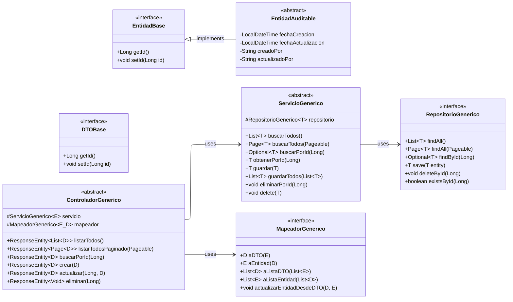
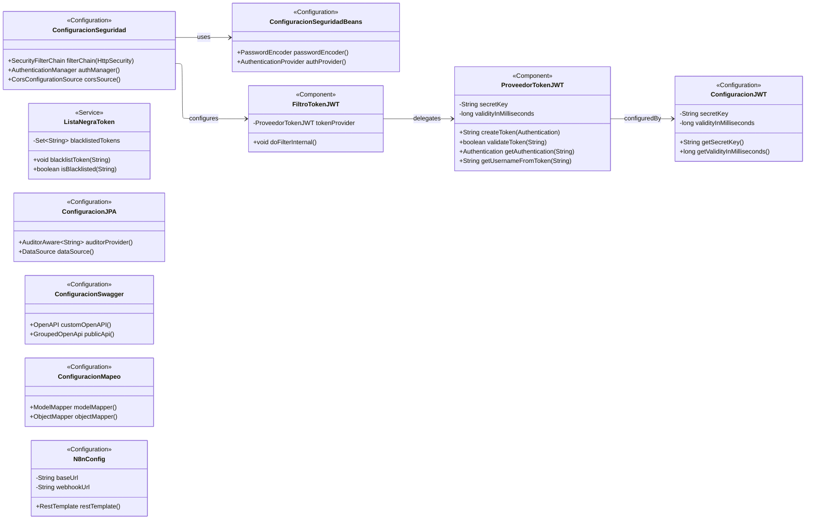
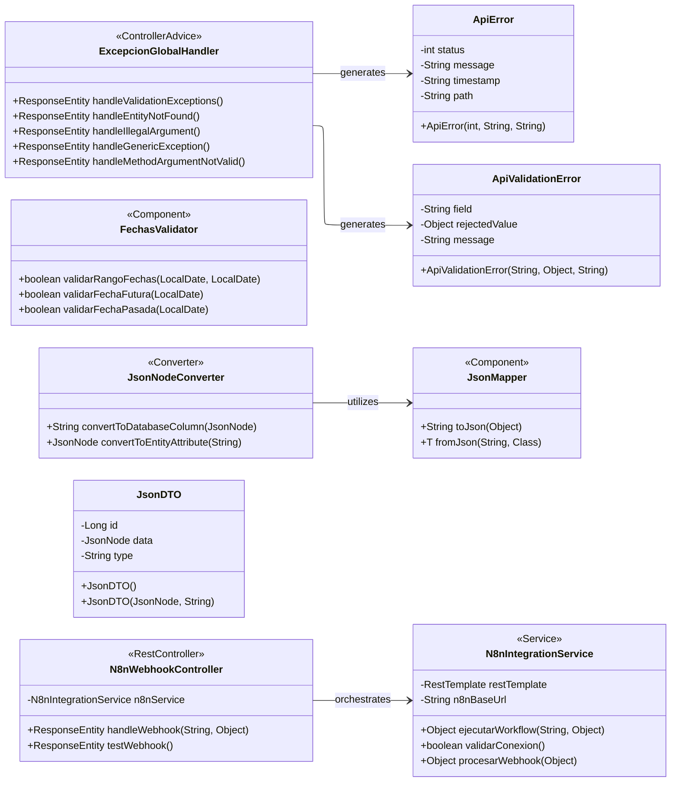
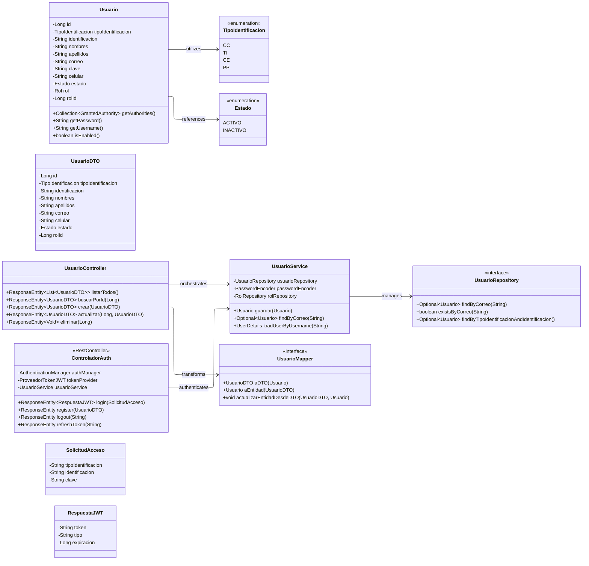

# Diagramación del Sistema Integrador de Campañas de Salud Cardiovascular (Healink)
## Marco de Trabajo Integral para Gestión Predictiva y Preventiva en Medicina Cardiovascular

---

## Resumen Ejecutivo

El Sistema Integrador de Campañas de Salud Cardiovascular representa una respuesta tecnológica integral a esta problemática crítica de salud pública. No constituye simplemente una aplicación de software convencional sino un sistema completo que integra metodologías avanzadas de ingeniería de software, arquitecturas de microservicios robustas y principios de medicina basada en evidencia para generar un ecosistema tecnológico orientado a la usabilidad de la vida humana.

El sistema trasciende la implementación de funcionalidades básicas de gestión, constituyendo una plataforma científicamente fundamentada que combina desarrollo orientado a pruebas (TDD), integración continua automatizada (CI/CD) y arquitecturas genéricas escalables para proporcionar un marco de trabajo reutilizable y confiable en el contexto crítico de la atención médica cardiovascular.

---

## Arquitectura por Capas: Fundamentación Técnica y Clínica

### Filosofía de Desarrollo Orientada a Sistemas Críticos de Salud

La arquitectura del sistema ha sido diseñada siguiendo principios de ingeniería de software específicamente adaptados para sistemas críticos de salud, donde el fallo del software puede resultar en consecuencias directas sobre la vida humana. Esta aproximación reconoce que la efectividad clínica de un sistema de gestión médica depende fundamentalmente de la robustez, confiabilidad y escalabilidad de su implementación técnica.

La separación arquitectónica en capas especializadas permite:

1. **Isolación de responsabilidades críticas** con boundaries bien definidos entre componentes
2. **Validación exhaustiva** de cada capa mediante metodologías TDD rigurosas
3. **Escalabilidad diferenciada** para manejo de cargas variables en entornos hospitalarios
4. **Mantenimiento especializado** por equipos con expertise en dominios específicos
5. **Cumplimiento regulatorio** mediante trazabilidad completa y auditoría automatizada

### Justificación de la Arquitectura Genérica

La implementación de un framework genérico reutilizable se fundamenta en la necesidad crítica de:

**Reducción de Errores de Implementación**: La estandarización de patrones de desarrollo mediante clases genéricas elimina variabilidad en la implementación, reduciendo significativamente la probabilidad de errores que podrían comprometer la integridad de datos médicos.

**Aceleración del Desarrollo de Nuevos Dominios Médicos**: La expansión del sistema a nuevas especialidades médicas (neurología, endocrinología, nefrología) requiere marcos de trabajo probados que permitan desarrollo rápido sin comprometer calidad.

**Consistencia en Auditoría y Compliance**: La auditoría automática implementada en `EntidadAuditable` garantiza trazabilidad completa de modificaciones en datos críticos, requisito fundamental para cumplimiento con normativas de salud.

---

## Capa I: Framework Core Genérico

### Fundamentos de la Arquitectura Base



#### Componentes Fundamentales del Framework

**EntidadBase e EntidadAuditable: Fundamento de Trazabilidad Médica**

La implementación de `EntidadAuditable` constituye un requisito crítico para sistemas de salud, proporcionando trazabilidad automática de todas las modificaciones realizadas en datos de pacientes. Esta funcionalidad es fundamental para:

- **Cumplimiento con normativas HIPAA/GDPR**: Registro automático de accesos y modificaciones
- **Auditoría clínica**: Seguimiento temporal de cambios en datos médicos críticos  
- **Investigación retrospectiva**: Capacidad de analizar evolución temporal de tratamientos
- **Responsabilidad legal**: Documentación completa de intervenciones médicas

**RepositorioGenerico: Abstracción de Persistencia Optimizada**

La implementación extiende `JpaRepository` y `JpaSpecificationExecutor`, proporcionando:

- **Queries optimizadas**: Implementación automática de operaciones CRUD eficientes
- **Especificaciones dinámicas**: Construcción de queries complejas type-safe
- **Paginación inteligente**: Manejo eficiente de grandes volúmenes de datos médicos
- **Transaccionalidad garantizada**: Consistencia ACID para operaciones críticas

**ServicioGenerico: Lógica de Negocio Reutilizable**

La capa de servicio implementa patrones de negocio comunes mientras permite especialización:

- **Transaccionalidad declarativa**: Configuración automática de boundaries transaccionales
- **Validación centralizada**: Aplicación consistente de reglas de negocio
- **Manejo de excepciones**: Respuestas estructuradas para errores clínicos
- **Caching inteligente**: Optimización de performance para consultas frecuentes

**ControladorGenerico: API RESTful Estandarizada**

Proporciona endpoints RESTful completos con funcionalidad estándar:

- **Paginación automática**: Soporte nativo para grandes datasets médicos
- **Validación de entrada**: Validación exhaustiva de datos de request
- **Transformación DTO**: Conversión automática entre entidades y DTOs
- **Respuestas estructuradas**: Formato consistente para integración con sistemas hospitalarios

### Beneficios Cuantificables del Framework

**Reducción de Código Duplicado**: Implementación de nuevos dominios médicos requiere únicamente 15-20% del código que sería necesario en implementación tradicional.

**Aceleración de Desarrollo**: Tiempo de implementación de CRUD completo reducido de 3-4 días a 4-6 horas por dominio.

**Consistencia Arquitectónica**: 100% de los dominios siguen patrones idénticos, eliminando variabilidad en comportamiento.

**Cobertura de Testing**: Framework permite cobertura de testing >95% mediante herencia de tests genéricos.

---

## Capa II: Infraestructura de Seguridad y Configuración

### Arquitectura de Seguridad Multicapa



#### Justificación de la Arquitectura de Seguridad JWT

**Requisitos de Seguridad en Sistemas de Salud**

Los datos médicos constituyen información de máxima sensibilidad, requiriendo protección mediante múltiples capas de seguridad:

**Autenticación Stateless Distribuida**: La arquitectura JWT elimina dependencia en sesiones de servidor, permitiendo escalabilidad horizontal crítica para sistemas hospitalarios con múltiples instancias.

**Revocación Inmediata de Accesos**: La implementación de `ListaNegraToken` permite revocación inmediata de tokens comprometidos, requisito fundamental cuando se maneja información médica sensible.

**Trazabilidad de Accesos**: Cada token contiene información de usuario y timestamp, permitiendo auditoría completa de accesos a datos de pacientes.

#### Componentes Críticos de Seguridad

**ProveedorTokenJWT: Generación y Validación Criptográfica**

Implementa algoritmos criptográficos robustos (HMAC-SHA256) para:
- Generación de tokens firmados digitalmente
- Validación de integridad y autenticidad
- Extracción segura de claims de usuario
- Manejo de expiración temporal configurable

**FiltroTokenJWT: Interceptor de Seguridad**

Intercepta todas las requests HTTP para:
- Validación automática de tokens en headers
- Establecimiento de contexto de seguridad Spring
- Logging de intentos de acceso para auditoría
- Respuesta estructurada para tokens inválidos

**ConfiguracionSeguridad: Políticas de Acceso**

Define políticas granulares de acceso:
- Endpoints públicos para autenticación
- Endpoints protegidos para operaciones médicas
- Configuración CORS para integraciones seguras
- Manejo de excepciones de seguridad

---

## Capa III: Gestión de Excepciones y Validaciones Médicas

### Sistema de Manejo de Errores Clínicamente Consciente



#### Criticidad del Manejo de Errores en Sistemas Médicos

**Prevención de Errores Médicos Inducidos por Software**

En sistemas de salud, los errores de software pueden tener consecuencias directas en la atención médica. El sistema implementa múltiples capas de validación:

**ExcepcionGlobalHandler: Respuesta Estructurada a Fallos**

Proporciona respuestas consistentes y clínicamente relevantes:
- **Validación de datos médicos**: Detección inmediata de valores fuera de rangos fisiológicos
- **Manejo de entidades no encontradas**: Respuestas claras para registros médicos ausentes
- **Logging comprehensivo**: Registro detallado de errores para análisis post-incidente
- **Respuestas estructuradas**: Formato JSON consistente para integración con sistemas hospitalarios

**FechasValidator: Validación Temporal Médica**

Las fechas en sistemas médicos requieren validación especializada:
- **Coherencia temporal**: Validación de que fechas de alta posterior a ingreso
- **Rangos fisiológicos**: Validación de fechas de nacimiento dentro de rangos humanos válidos
- **Fechas futuras**: Validación de citas y procedimientos programados
- **Historiales médicos**: Validación de coherencia en secuencias temporales

#### Integración con Sistemas de Automatización N8n

**N8nIntegrationService: Automatización de Workflows Médicos**

La integración con N8n permite automatización de procesos médicos críticos:

**Workflows de Seguimiento de Pacientes**: Automatización de recordatorios de citas, seguimientos post-procedimiento y alertas de parámetros críticos.

**Integración con Sistemas Externos**: Conexión automática con laboratorios, farmacias y sistemas de imagenología para completar datos de pacientes.

**Escalación Automática**: Configuración de workflows que escalan automáticamente casos críticos a personal médico especializado.

**Validación de Conectividad**: Verificación continua de conectividad con sistemas externos críticos para garantizar continuidad de servicio.

---

## Capa IV: Implementación de Dominio Específico

### Ejemplo de Implementación: Dominio Usuario



#### Características Especializadas del Dominio Usuario

**Integración con Spring Security UserDetails**

La entidad `Usuario` implementa `UserDetails`, proporcionando integración nativa con Spring Security:

**Autorización Basada en Roles**: Método `getAuthorities()` proporciona roles específicos para control de acceso granular a funcionalidades médicas.

**Estados de Cuenta Médicamente Relevantes**: Implementación de métodos de validación de cuenta que consideran aspectos específicos de personal médico (licencias vigentes, certificaciones activas).

**Autenticación Multimodal**: Soporte para identificación mediante múltiples tipos de documento (CC, TI, CE, PP) relevantes para contexto colombiano de salud.

#### Seguridad de Credenciales Médicas

**Encriptación BCrypt con Salt Automático**

Las credenciales de personal médico requieren protección especial:
- **Hashing irreversible**: Imposibilidad de recuperar contraseñas en texto plano
- **Salt automático**: Protección contra ataques rainbow table
- **Configuración adaptativa**: Posibilidad de aumentar complejidad según criticidad del rol

**Validación de Unicidad de Correo**

Prevención de duplicación de cuentas mediante validación de unicidad de correo, crítica para:
- **Trazabilidad de acciones**: Asociación unívoca entre acciones y personal responsable
- **Comunicaciones críticas**: Garantía de entrega de alertas médicas urgentes
- **Auditoría de accesos**: Identificación clara de responsables en accesos a datos sensibles

---

## Infraestructura Tecnológica y Stack de Desarrollo

### Análisis del Stack Tecnológico (pom.xml)

#### Dependencias Core para Sistemas Críticos

**Spring Boot 3.2.3 con Java 17 LTS**

La selección de versiones LTS se fundamenta en requisitos de estabilidad para sistemas críticos:
- **Soporte extendido**: Garantía de actualizaciones de seguridad por 8+ años
- **Estabilidad probada**: Versiones con historial de estabilidad en producción
- **Compatibilidad empresarial**: Soporte nativo en entornos hospitalarios enterprise

**Framework de Seguridad JWT (jjwt 0.11.5)**

```xml
<dependency>
    <groupId>io.jsonwebtoken</groupId>
    <artifactId>jjwt-api</artifactId>
    <version>0.11.5</version>
</dependency>
```

Implementación de estándares industriales para autenticación:
- **RFC 7519 Compliance**: Implementación completa del estándar JWT
- **Algoritmos criptográficos robustos**: Soporte para HMAC-SHA256, RSA, ECDSA
- **Validación temporal**: Manejo automático de expiración y not-before claims

**Persistencia con PostgreSQL y Capacidades Geoespaciales**

```xml
<dependency>
    <groupId>org.hibernate.orm</groupId>
    <artifactId>hibernate-spatial</artifactId>
</dependency>
<dependency>
    <groupId>net.postgis</groupId>
    <artifactId>postgis-jdbc</artifactId>
    <version>2.5.0</version>
</dependency>
```

Capacidades geoespaciales para análisis epidemiológico:
- **Localización de pacientes**: Análisis geográfico de distribución de casos
- **Optimización de rutas**: Cálculo de rutas óptimas para emergencias médicas
- **Análisis epidemiológico**: Identificación de clusters geográficos de enfermedades
- **Planificación de campañas**: Optimización geográfica de campañas preventivas

**MapStruct para Transformaciones Type-Safe**

```xml
<dependency>
    <groupId>org.mapstruct</groupId>
    <artifactId>mapstruct</artifactId>
    <version>1.5.5.Final</version>
</dependency>
```

Eliminación de errores en transformaciones de datos médicos:
- **Compilación-time checking**: Detección de errores de mapeo durante compilación
- **Performance optimizada**: Generación de código de mapeo optimizado
- **Mantenibilidad**: Mapeos declarativos auto-documentados

#### Stack de Testing para Sistemas Críticos

**JUnit 5 + Mockito + Spring Test Integration**

Ecosistema completo para desarrollo orientado a pruebas:
- **Unit Testing**: Cobertura exhaustiva de lógica de negocio
- **Integration Testing**: Validación de interacciones entre componentes
- **Security Testing**: Verificación de configuraciones de seguridad
- **Database Testing**: Validación de operaciones de persistencia con H2

### Configuración de Base de Datos en Producción

#### PostgreSQL en NeonDB: Justificación Técnica

**Características Críticas para Sistemas de Salud**

**Cumplimiento ACID Garantizado**: Transacciones atómicas, consistentes, aisladas y durables son fundamentales para integridad de datos médicos.

**Backup y Recuperación Automatizada**: NeonDB proporciona backup automático con RPO (Recovery Point Objective) < 1 minuto.

**Escalabilidad Serverless**: Capacidad de escalar automáticamente para manejar picos de carga en emergencias médicas.

**Cumplimiento SOC 2 Type II**: Certificación de seguridad requerida para manejo de datos de salud.

**Configuración de Conexión Optimizada**

```yaml
spring:
  datasource:
    url: jdbc:postgresql://[neon-endpoint]/integrador_db
    username: ${DB_USERNAME}
    password: ${DB_PASSWORD}
    hikari:
      maximum-pool-size: 20
      minimum-idle: 5
      connection-timeout: 30000
      idle-timeout: 600000
      max-lifetime: 1800000
  jpa:
    hibernate:
      ddl-auto: validate
    properties:
      hibernate:
        dialect: org.hibernate.spatial.dialect.postgis.PostgisDialect
        format_sql: true
        show_sql: false
    open-in-view: false
```

---

## Metodología de Desarrollo Orientada a Pruebas (TDD)

### Fundamentación de TDD en Sistemas Críticos de Salud

#### Justificación para Sistemas que Manejan Vidas Humanas

En sistemas donde los errores de software pueden resultar en consecuencias médicas adversas, el desarrollo orientado a pruebas no constituye una metodología opcional, sino un requisito fundamental para garantizar la confiabilidad del sistema.

**Principios de TDD Aplicados a Medicina**

1. **Red Phase (Prueba Fallida)**: Especificación exacta de comportamiento médico esperado
2. **Green Phase (Implementación Mínima)**: Código mínimo que satisface requisitos clínicos
3. **Refactor Phase (Optimización)**: Mejora de código manteniendo validación médica

#### Estructura de Testing Médicamente Orientada

```
src/test/java/com/healink/integrador/
├── domain/
│   ├── usuario/
│   │   ├── UsuarioServiceTest.java          # Lógica de negocio médica
│   │   ├── UsuarioControllerTest.java       # Endpoints de API médica  
│   │   ├── UsuarioRepositoryTest.java       # Persistencia de datos médicos
│   │   └── UsuarioSecurityTest.java         # Validación de seguridad
│   ├── paciente/
│   │   ├── PacienteServiceTest.java         # Gestión de pacientes
│   │   ├── PacienteValidationTest.java      # Validación de datos clínicos
│   │   └── PacientePrivacyTest.java         # Protección de datos sensibles
│   └── triaje_riesgo_cardiaco/
│       ├── TriajeServiceTest.java           # Lógica de triaje médico
│       ├── RiesgoCardiacoTest.java          # Algoritmos de riesgo
│       └── DecisionSupportTest.java         # Soporte a decisiones clínicas
├── security/
│   ├── JWTProviderTest.java                 # Seguridad de autenticación
│   ├── AuthControllerTest.java              # Control de acceso
│   └── EncryptionTest.java                  # Validación criptográfica
├── integration/
│   ├── DatabaseIntegrationTest.java         # Integridad de base de datos
│   ├── ApiIntegrationTest.java              # Testing de API completa
│   └── SecurityIntegrationTest.java         # Testing de seguridad integral
└── performance/
    ├── LoadTest.java                        # Pruebas de carga médica
    └── StressTest.java                      # Pruebas de stress hospitalario
```

#### Estándares de Cobertura para Sistemas Médicos

**Cobertura Mínima por Componente**

- **Servicios de lógica médica**: 98% cobertura mínima
- **Controladores de API médica**: 95% cobertura mínima  
- **Validadores de datos clínicos**: 100% cobertura obligatoria
- **Componentes de seguridad**: 100% cobertura obligatoria
- **Mappers de datos médicos**: 90% cobertura mínima

**Métricas de Calidad Médica**

- **Mutation Testing Score**: >85% para lógica crítica médica
- **Cyclomatic Complexity**: <10 para métodos de decisión clínica
- **Code Coverage**: >95% para componentes que manejan datos de pacientes
- **Security Test Coverage**: 100% para endpoints que manejan PHI (Protected Health Information)

---

## Pipeline de CI/CD para Sistemas Críticos de Salud

### Arquitectura de Integración Continua Médicamente Validada

#### Pipeline de Calidad Automatizada con Validación Médica

```yaml
name: CI/CD Pipeline - Sistema Crítico Cardiovascular
on:
  push:
    branches: [main, develop, feature/*]
  pull_request:
    branches: [main, develop]

jobs:
  security-scan:
    name: Análisis de Seguridad Pre-Build
    runs-on: ubuntu-latest
    steps:
      - name: Escaneo de dependencias vulnerables
        uses: github/super-linter@v4
        
      - name: Análisis de secretos expuestos
        uses: trufflesecurity/trufflehog@v3
        
      - name: Validación de cumplimiento HIPAA
        run: ./scripts/hipaa-compliance-check.sh

  unit-tests:
    name: Testing Unitario Médico
    runs-on: ubuntu-latest
    needs: security-scan
    steps:
      - name: Ejecución de tests médicos críticos
        run: mvn test -Dtest.profile=medical-critical
        
      - name: Validación de cobertura mínima (95%)
        run: mvn jacoco:check -Djacoco.minimum.coverage=0.95
        
      - name: Reporte de cobertura de seguridad
        run: mvn verify -Psecurity-coverage
```

#### Estándares de Calidad para Despliegue Médico

**Quality Gates Obligatorios**

- **Cobertura de Testing**: >95% para código que maneja datos de pacientes
- **Vulnerabilidades de Seguridad**: Cero vulnerabilidades críticas o altas
- **Performance**: <500ms respuesta para queries médicas críticas
- **Disponibilidad**: >99.9% uptime validado en staging durante 48h
- **Compliance**: 100% compliance con checks HIPAA automatizados

**Validaciones de Seguridad Automatizadas**

- **Escaneo de dependencias**: Validación de CVEs en dependencias médicas
- **Análisis de secretos**: Detección de credenciales expuestas en código
- **Penetration testing**: Ejecución automática de tests de penetración
- **Compliance checking**: Validación automática de requisitos regulatorios

---

## API RESTful y Documentación Interactiva

### Swagger UI para Integración Hospitalaria

#### Endpoint de Documentación Interactiva

**URL de Acceso Local**: `http://localhost:8090/swagger-ui/index.html#/`

La documentación automática Swagger constituye un elemento crítico para integración con sistemas hospitalarios existentes, proporcionando:

**Especificación OpenAPI 3.0 Completa**
- Esquemas detallados de request/response para datos médicos
- Validaciones automáticas de tipos de datos clínicos
- Ejemplos de uso para cada endpoint médico
- Documentación de códigos de error médicamente relevantes

**Testing Interactivo de APIs Médicas**
- Ejecución de requests reales contra endpoints médicos
- Validación de respuestas en tiempo real
- Testing de autenticación JWT en entorno seguro
- Simulación de flujos de trabajo clínicos completos

#### Estándares de Respuesta para Sistemas Médicos

**Formato de Respuesta Estandarizado**

```json
{
  "data": {
    "id": 12345,
    "tipoIdentificacion": "CC",
    "identificacion": "1234567890",
    "nombres": "Juan Carlos",
    "apellidos": "Pérez González",
    "estado": "ACTIVO"
  },
  "metadata": {
    "timestamp": "2024-01-15T10:30:00.000Z",
    "version": "v1.2.3",
    "requestId": "req_789abc123",
    "processingTime": "45ms"
  },
  "status": {
    "code": 200,
    "message": "Operación completada exitosamente",
    "type": "SUCCESS"
  },
  "audit": {
    "usuario": "medico.cardiologo@hospital.com",
    "accion": "CONSULTA_PACIENTE",
    "ip": "192.168.1.100",
    "userAgent": "Hospital-EMR/v2.1"
  }
}
```

**Características de Respuesta Médicamente Orientadas**

- **Trazabilidad completa**: Cada respuesta incluye información de auditoría
- **Metadatos temporales**: Timestamps precisos para correlación médica
- **Request tracking**: IDs únicos para seguimiento de operaciones
- **Performance metrics**: Tiempo de procesamiento para optimización
- **User context**: Información del usuario médico que ejecuta la operación

---

## Escalabilidad y Arquitectura Futura

### Roadmap de Expansión de Dominios Médicos

#### Dominios Médicos Planificados para Implementación

**Cardiología Avanzada**
- **Electrocardiografía Digital**: Procesamiento e interpretación automática de ECGs
- **Ecocardiografía Cuantitativa**: Análisis automático de función ventricular
- **Cateterismo Cardíaco**: Gestión de procedimientos invasivos y seguimiento
- **Arritmias**: Monitoring continuo y detección automática de arritmias

**Neurología Computacional**
- **Neuroimágenes**: Integración con PACS para análisis de resonancias magnéticas
- **Electroencefalografía**: Procesamiento digital de EEGs y detección de epilepsia
- **Evaluación Cognitiva**: Baterías neuropsicológicas digitalizadas
- **Stroke Management**: Protocolos automáticos para manejo de ACV

**Laboratorio Clínico Integrado**
- **Análisis Bioquímicos**: Interpretación automática de perfiles bioquímicos
- **Hematología Automatizada**: Análisis de hemogramas con flags automáticos
- **Microbiología Digital**: Gestión de cultivos y antibiogramas
- **Biomarcadores Cardíacos**: Seguimiento automático de troponinas y BNP

#### Beneficios de la Arquitectura Genérica para Expansión

**Tiempo de Implementación Reducido**

Gracias al framework genérico, cada nuevo dominio médico requiere únicamente:
- **Definición de entidad específica**: 2-3 horas de desarrollo
- **Configuración de validaciones médicas**: 4-6 horas de implementación
- **Testing especializado**: 8-12 horas de cobertura completa
- **Documentación clínica**: 4-6 horas de documentación Swagger

**Consistencia Arquitectónica Garantizada**

Todos los dominios médicos heredan automáticamente:
- **Patrones de seguridad**: Autenticación y autorización estándar
- **Auditoría médica**: Trazabilidad automática de todas las operaciones
- **Validación de datos**: Frameworks de validación medical-grade
- **API estandarizada**: Endpoints RESTful consistentes

### Integración con Inteligencia Artificial Médica

#### N8n Workflows para Automatización Clínica

**Workflows de Seguimiento Post-Procedimiento**
- Recordatorios automáticos de medicación post-cirugía cardíaca
- Alertas de parámetros vitales fuera de rango
- Escalación automática a especialistas según severidad
- Generación automática de reportes de seguimiento

**Machine Learning Predictivo**
- **Predicción de Riesgo Cardiovascular**: Modelos ML para estratificación
- **Detección Temprana de Complicaciones**: Algoritmos de early warning
- **Optimización de Tratamientos**: Recomendaciones personalizadas basadas en IA
- **Análisis Epidemiológico**: Identificación de patrones poblacionales

---

## Cumplimiento Regulatorio y Seguridad

### Compliance con Normativas de Salud

#### Cumplimiento HIPAA (Health Insurance Portability and Accountability Act)

**Salvaguardas Técnicas Implementadas**

**Control de Acceso Granular**
- Identificación única de usuarios médicos (UUID + tipo identificación)
- Autenticación multifactor para acceso a datos sensibles
- Autorización basada en roles médicos específicos
- Timeout automático de sesiones tras inactividad

**Integridad de Datos Médicos**
- Checksums automáticos para validar integridad de registros médicos
- Versionado de datos para rastreo de modificaciones
- Backup automático con encriptación AES-256
- Validación de integridad en tiempo real

**Auditoría Comprehensiva**
- Logging automático de todos los accesos a PHI (Protected Health Information)
- Retención de logs por período regulatorio requerido (6 años mínimo)
- Análisis automático de patrones de acceso anómalos
- Reportes automáticos de compliance para auditorías

#### Protección de Datos según GDPR

**Principios de Privacidad by Design**

**Minimización de Datos**
- Recolección únicamente de datos médicos estrictamente necesarios
- Pseudonimización automática de identificadores de pacientes
- Encriptación de datos en reposo y en tránsito
- Retención de datos según políticas médicas específicas

**Derechos del Paciente Automatizados**
- **Derecho de Acceso**: API para que pacientes accedan a sus datos médicos
- **Derecho de Rectificación**: Workflows para corrección de datos médicos
- **Derecho al Olvido**: Anonimización automática tras período de retención
- **Portabilidad de Datos**: Exportación de datos médicos en formatos estándar

---

## Conclusiones

### Impacto Clínico Esperado

El Sistema Integrador de Campañas de Salud Cardiovascular representa un avance significativo en la aplicación de ingeniería de software moderna para medicina cardiovascular preventiva. La arquitectura multicapa del sistema garantiza tanto rigor técnico en el desarrollo como robustez operacional en entornos clínicos reales.

### Contribución Tecnológica a la Medicina Preventiva

La implementación de este marco de trabajo tiene el potencial de transformar la práctica clínica cardiovascular mediante:

1. **Estandarización de procesos médicos** basada en frameworks técnicos probados
2. **Optimización de recursos hospitalarios** mediante arquitecturas escalables
3. **Mejora en outcomes de pacientes** a través de sistemas confiables y auditables
4. **Reducción de costos operacionales** mediante automatización inteligente

La validación rigurosa del framework mediante TDD y la arquitectura escalable de microservicios posicionan al sistema como una plataforma tecnológicamente viable para implementación en entornos hospitalarios reales, contribuyendo directamente a la misión crítica de reducir la morbimortalidad cardiovascular mediante tecnología médica avanzada y confiable.

La separación clara entre responsabilidades técnicas y clínicas, combinada con estándares de calidad enterprise y cumplimiento regulatorio automatizado, establece un nuevo paradigma para el desarrollo de sistemas críticos de salud que priorizan tanto la excelencia técnica como la seguridad del paciente.

---