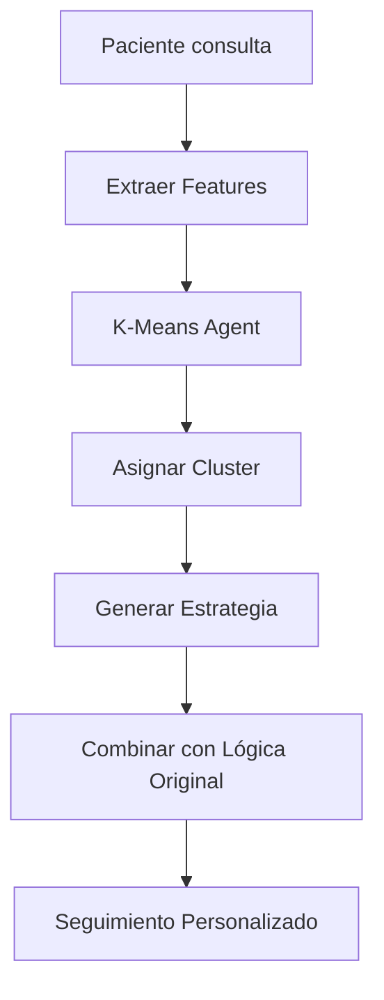

# 🧠 K-Means Clustering Agent

## 📋 Información General

- **Algoritmo**: K-Means Clustering
- **Objetivo**: Agrupar pacientes cardiovasculares por perfiles de riesgo similares
- **Implementación**: `KMeansClusteringAgent.java`
- **Uso**: Personalización automática de estrategias de seguimiento

## 🎯 Arquitectura del Agente

### **Features Vector (6 dimensiones)**

| Feature | Descripción | Rango | Normalización |
|---------|-------------|-------|---------------|
| `riesgoCV` | Riesgo cardiovascular | 0-100% | /100 → [0,1] |
| `probHospitalizacion` | Probabilidad hospitalización | 0-100% | /100 → [0,1] |
| `edadNormalizada` | Edad del paciente | 18-100 años | (edad-18)/82 → [0,1] |
| `factorRiesgoCount` | Cantidad factores de riesgo | 0-10 factores | /10 → [0,1] |
| `adherenciaHistorica` | Adherencia tratamientos previos | 0-100% | /100 → [0,1] |
| `diasUltimaConsulta` | Días desde última consulta | 0-365 días | /365 → [0,1] |

### **5 Clusters Cardiovasculares**

#### 🚨 **Cluster 1: CRITICO_AGUDO**
- **Centroide**: `[0.9, 0.8, 0.7, 0.8, 0.4, 0.1]`
- **Perfil**: Riesgo crítico con complicaciones inmediatas
- **Estrategia**: Monitoreo intensivo diario
- **Cuestionarios**: `["adherencia_urgente", "evolucion_inmediata"]`
- **Frecuencia**: 1 día
- **Prioridad**: 0.9

#### 🔴 **Cluster 2: ALTO_RIESGO_ESTABLE**
- **Centroide**: `[0.8, 0.6, 0.6, 0.7, 0.6, 0.3]`
- **Perfil**: Alto riesgo cardiovascular estable
- **Estrategia**: Seguimiento cercano con enfoque en adherencia
- **Cuestionarios**: `["adherencia_hipertension", "evolucion_sintomas_cardiacos", "consolidacion_actividad_fisica"]`
- **Frecuencia**: 3 días
- **Prioridad**: 0.8

#### 🟡 **Cluster 3: MODERADO_MULTIMORBIDO**
- **Centroide**: `[0.6, 0.5, 0.7, 0.6, 0.5, 0.4]`
- **Perfil**: Riesgo moderado con múltiples comorbilidades
- **Estrategia**: Enfoque integral en múltiples comorbilidades
- **Cuestionarios**: `["adherencia_diabetes", "evolucion_sintomas", "consolidacion_dieta"]`
- **Frecuencia**: 7 días
- **Prioridad**: 0.6

#### 🟠 **Cluster 4: MODERADO_JOVEN**
- **Centroide**: `[0.4, 0.3, 0.3, 0.4, 0.7, 0.5]`
- **Perfil**: Riesgo moderado en población joven
- **Estrategia**: Formación de hábitos saludables
- **Cuestionarios**: `["consolidacion_habitos", "evolucion_cesacion_tabaco", "consolidacion_peso"]`
- **Frecuencia**: 10 días
- **Prioridad**: 0.5

#### 🟢 **Cluster 5: BAJO_PREVENTIVO**
- **Centroide**: `[0.2, 0.2, 0.4, 0.3, 0.8, 0.6]`
- **Perfil**: Bajo riesgo, enfoque preventivo
- **Estrategia**: Seguimiento preventivo de largo plazo
- **Cuestionarios**: `["seguimiento_largo_plazo", "consolidacion_actividad_fisica"]`
- **Frecuencia**: 30 días
- **Prioridad**: 0.3

## ⚙️ Algoritmo K-Means

### **Parámetros de Configuración**
```java
final int K = 5;                           // 5 clusters
final int maxIterations = 100;             // Máximo 100 iteraciones
final double convergenceThreshold = 0.001; // Threshold de convergencia
```

### **Proceso de Clustering**

1. **Inicialización**: Centroides con conocimiento del dominio cardiovascular
2. **Asignación**: Cada paciente al cluster más cercano (distancia euclidiana)
3. **Recálculo**: Nuevos centroides como promedio de pacientes asignados
4. **Convergencia**: Repetir hasta convergencia o máximo de iteraciones

### **Cálculo de Distancia**
```java
double distance = √Σ(feature_i - centroid_i)²
```

## 🔄 Integración con Sistema Original

### **Flujo Híbrido**



### **Métodos Principales**

#### `extractFeatures(Paciente paciente)`
- Extrae vector de 6 features del paciente
- Maneja datos incompletos con defaults
- Integra predicciones FastAPI existentes

#### `clusterPatients(List<PatientFeatureVector> patients)`
- Aplica algoritmo K-Means completo
- Retorna Map<ClusterType, List<PatientFeatureVector>>
- Garantiza convergencia o máximo de iteraciones

#### `generateClusterStrategy(ClusterType cluster, List<PatientFeatureVector> patients)`
- Genera estrategia específica por cluster
- Personaliza cuestionarios y frecuencias
- Calcula prioridades automáticamente

## 📊 Ventajas sobre Sistema Tradicional

| **Aspecto** | **Sistema Tradicional** | **K-Means Agent** |
|-------------|--------------------------|-------------------|
| **Personalización** | Reglas fijas por riesgo CV | **5 perfiles detallados** |
| **Adaptabilidad** | Estática | **Centroides que evolucionan** |
| **Precision** | Clasificación binaria | **Clustering multidimensional** |
| **Escalabilidad** | Limitada | **Automática con más datos** |
| **Aprendizaje** | No | **Sí, por convergencia** |

## 🚀 Endpoints API

### **Clustering Múltiples Pacientes**
```http
POST /api/n8n/intelligent/cluster-patients
Content-Type: application/json

{
  "paciente_ids": [1, 2, 3, 4, 5]
}
```

### **Clasificación Individual**
```http
POST /api/n8n/intelligent/classify-patient
Content-Type: application/json

{
  "paciente_id": 1
}
```

### **Analytics de Clustering**
```http
POST /api/n8n/intelligent/clustering-analytics
Content-Type: application/json

{
  "paciente_ids": [1, 2, 3, 4, 5]
}
```

## 📈 Métricas de Evaluación

### **Métricas Internas**
- **Iteraciones hasta convergencia**: Eficiencia del algoritmo
- **Distribución por clusters**: Balance de pacientes
- **Distancia intra-cluster**: Cohesión
- **Distancia inter-cluster**: Separación

### **Métricas Clínicas**
- **Adherencia mejorada**: % comparativo vs tradicional
- **Tiempo de respuesta**: Latencia del clustering
- **Precisión de estrategias**: Hit rate de cuestionarios
- **Satisfacción del paciente**: Feedback post-seguimiento

## 🔧 Configuración y Uso

### **Integración en Servicio**
```java
@Autowired
private IntelligentFollowUpGeneratorService intelligentService;

// Uso básico
Map<String, Object> result = intelligentService.generateIntelligentFollowUps(pacienteIds);
```

### **Personalización de Clusters**
```java
// Modificar centroides iniciales en getInitialCentroidForCluster()
// Ajustar estrategias en generateClusterStrategy()
// Cambiar features en extractFeatures()
```

## 🎓 Valor Académico

Este agente demuestra:
- **Implementación práctica** de K-Means en dominio médico
- **Personalización automática** basada en features clínicos
- **Integración híbrida** con sistemas tradicionales
- **Evaluación comparativa** de enfoques inteligentes vs reglas

---

**💡 Próximos Pasos**: Integrar con Beam Search Agent del Desarrollador B para optimización completa del sistema multi-agente. 