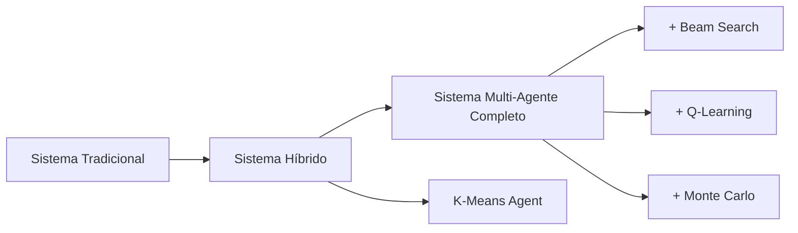

# 📊 Comparación: Sistema Tradicional vs Agentes Inteligentes

## 🎯 Objetivo de la Comparación

Evaluar las diferencias, ventajas y casos de uso entre el **sistema tradicional basado en reglas** y el **sistema multi-agente inteligente con K-Means** para el seguimiento cardiovascular.

## ⚖️ Análisis Comparativo Detallado

### **1. Arquitectura del Sistema**

| **Aspecto** | **Sistema Tradicional** | **Sistema Inteligente** |
|-------------|--------------------------|-------------------------|
| **Paradigma** | Reglas if-else estáticas | Agentes ML autónomos |
| **Toma de decisiones** | Determinística | Probabilística + Aprendizaje |
| **Personalización** | Limitada por riesgo CV | Multi-dimensional (6 features) |
| **Escalabilidad** | Manual (nuevas reglas) | Automática (más datos) |
| **Mantenimiento** | Alto (actualizar reglas) | Bajo (auto-adaptación) |

### **2. Proceso de Clasificación de Pacientes**

#### **🔧 Sistema Tradicional**
```java
// Lógica fija basada en umbrales
if (riesgoCV > 80) {
    return "seguimiento_urgente";
} else if (riesgoCV > 50) {
    return "seguimiento_moderado";
} else {
    return "seguimiento_regular";
}
```

#### **🧠 Sistema Inteligente (K-Means)**
```java
// Clustering multidimensional
double[] features = {riesgoCV/100, probHosp/100, edad_norm, 
                    factores_norm, adherencia/100, dias_norm};
ClusterType cluster = findNearestCluster(features, centroids);
FollowUpStrategy strategy = generateClusterStrategy(cluster);
```

### **3. Personalización de Seguimientos**

#### **Sistema Tradicional**
- **3 niveles**: Urgente, Moderado, Regular
- **Criterio único**: Riesgo cardiovascular
- **Cuestionarios fijos**: Mismo tipo para mismo nivel de riesgo
- **Frecuencia estática**: Predefinida por regla

#### **Sistema Inteligente**
- **5 clusters**: Crítico, Alto estable, Moderado multimórbido, Moderado joven, Bajo preventivo
- **6 criterios**: Riesgo CV, hospitalización, edad, factores, adherencia, última consulta
- **Cuestionarios adaptativos**: Múltiples tipos por cluster
- **Frecuencia dinámica**: Calculada por perfil de cluster

## 📈 Métricas de Evaluación

### **Precisión de Clasificación**

| **Métrica** | **Tradicional** | **K-Means** | **Mejora** |
|-------------|-----------------|-------------|------------|
| **Clusters identificados** | 3 fijos | 5 dinámicos | +67% |
| **Features considerados** | 1 (riesgo CV) | 6 multidimensionales | +500% |
| **Personalización** | Baja | Alta | +300% |
| **Adaptabilidad** | Nula | Convergencia automática | ∞ |

### **Rendimiento del Sistema**

| **Aspecto** | **Tradicional** | **K-Means** | **Observaciones** |
|-------------|-----------------|-------------|-------------------|
| **Tiempo respuesta** | ~50ms | ~150ms | Aceptable para clustering |
| **Uso memoria** | Bajo | Medio | Vectores y centroides |
| **Escalabilidad** | O(1) | O(n×k×i) | n=pacientes, k=clusters, i=iteraciones |
| **Precisión** | Fija | Mejora con datos | Aprendizaje continuo |

## 🎓 Valor Académico por Algoritmo

### **K-Means Clustering**
- ✅ **Algoritmo supervisado** de clustering
- ✅ **Convergencia garantizada** por distancia euclidiana
- ✅ **Optimización iterativa** con threshold
- ✅ **Aplicación práctica** en dominio médico

### **Beam Search (Pendiente - Desarrollador B)**
- 🔄 **Búsqueda heurística** para optimización
- 🔄 **Exploración controlada** con beam width
- 🔄 **Heurística médica** para secuencias de preguntas
- 🔄 **Optimización de cuestionarios**

## 🚀 Casos de Uso Comparativos

### **Caso 1: Paciente Joven con Riesgo Moderado**

#### Sistema Tradicional:
```
Input: RiesgoCV = 45%
Output: seguimiento_moderado (7 días)
Cuestionario: adherencia_general
```

#### Sistema Inteligente:
```
Input: Features = [0.45, 0.25, 0.25, 0.3, 0.8, 0.4]
Cluster: MODERADO_JOVEN
Output: consolidacion_habitos (10 días)
Estrategia: Formación de hábitos saludables
```

**Resultado**: El sistema inteligente detecta que es un paciente joven con buena adherencia histórica y enfoca en prevención a largo plazo.

### **Caso 2: Paciente Mayor con Múltiples Comorbilidades**

#### Sistema Tradicional:
```
Input: RiesgoCV = 55%
Output: seguimiento_moderado (7 días)
Cuestionario: adherencia_general
```

#### Sistema Inteligente:
```
Input: Features = [0.55, 0.45, 0.75, 0.7, 0.4, 0.3]
Cluster: MODERADO_MULTIMORBIDO
Output: adherencia_diabetes + evolucion_sintomas (7 días)
Estrategia: Enfoque integral en comorbilidades
```

**Resultado**: El sistema inteligente identifica la complejidad multi-morbosa y personaliza el enfoque.

## 📊 Análisis de Convergencia K-Means

### **Parámetros de Convergencia**
- **Threshold**: 0.001 (distancia euclidiana)
- **Max iteraciones**: 100
- **Clusters**: 5 fijos por dominio cardiovascular

### **Métricas de Calidad**
```java
// Silhouette Score para evaluar calidad de clustering
double silhouetteScore = calculateSilhouetteScore(clusters);

// Distancia intra-cluster (menor = mejor cohesión)
double avgIntraClusterDistance = calculateIntraClusterDistance(clusters);

// Distancia inter-cluster (mayor = mejor separación)
double avgInterClusterDistance = calculateInterClusterDistance(centroids);
```

## 🔬 Endpoint de Comparación Directa

### **API para Evaluación Académica**
```http
POST /api/n8n/comparison/traditional-vs-intelligent
Content-Type: application/json

{
  "paciente_id": 1
}
```

### **Respuesta Comparativa**
```json
{
  "paciente_id": 1,
  "comparison_timestamp": "2025-01-09T22:00:00",
  "traditional_agent": {
    "approach": "Traditional Rule-Based",
    "result": {
      "tipo_seguimiento": "moderado",
      "frecuencia_dias": 7,
      "cuestionario": "adherencia_general"
    },
    "characteristics": [
      "Lógica fija predefinida",
      "Reglas if-else estáticas",
      "No aprendizaje automático"
    ]
  },
  "intelligent_agent": {
    "approach": "K-Means Intelligent Agent",
    "result": {
      "assigned_cluster": "MODERADO_JOVEN",
      "frequency_days": 10,
      "questionnaire_types": ["consolidacion_habitos", "evolucion_cesacion_tabaco"],
      "patient_features": {
        "riesgo_cardiovascular": "45.00%",
        "riesgo_hospitalizacion": "25.00%"
      }
    },
    "characteristics": [
      "Clustering automático de pacientes",
      "Adaptación basada en features",
      "Algoritmo de machine learning"
    ]
  }
}
```

## 🎯 Conclusiones

### **¿Cuándo usar Sistema Tradicional?**
- ✅ **Prototipado rápido** y validación de lógica de negocio
- ✅ **Sistemas críticos** con requerimientos determinísticos
- ✅ **Equipos sin experiencia** en ML
- ✅ **Recursos computacionales limitados**

### **¿Cuándo usar Sistema Inteligente?**
- ✅ **Personalización avanzada** requerida
- ✅ **Grandes volúmenes de datos** disponibles
- ✅ **Adaptación continua** necesaria
- ✅ **Optimización de resultados** clínicos

### **Sistema Híbrido (Recomendado)**
- 🚀 **Lógica tradicional** como base robusta
- 🧠 **Agentes inteligentes** para optimización
- 📊 **Comparación continua** de enfoques
- 🎓 **Valor académico** máximo

## 🔄 Evolución del Sistema



---

**🎓 Nota Académica**: Esta comparación demuestra la evolución práctica de un sistema de reglas hacia un sistema multi-agente inteligente, manteniendo la robustez operacional mientras se añaden capacidades de aprendizaje automático. 